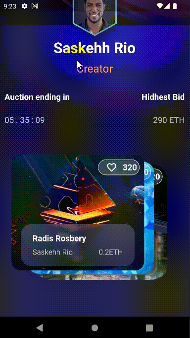
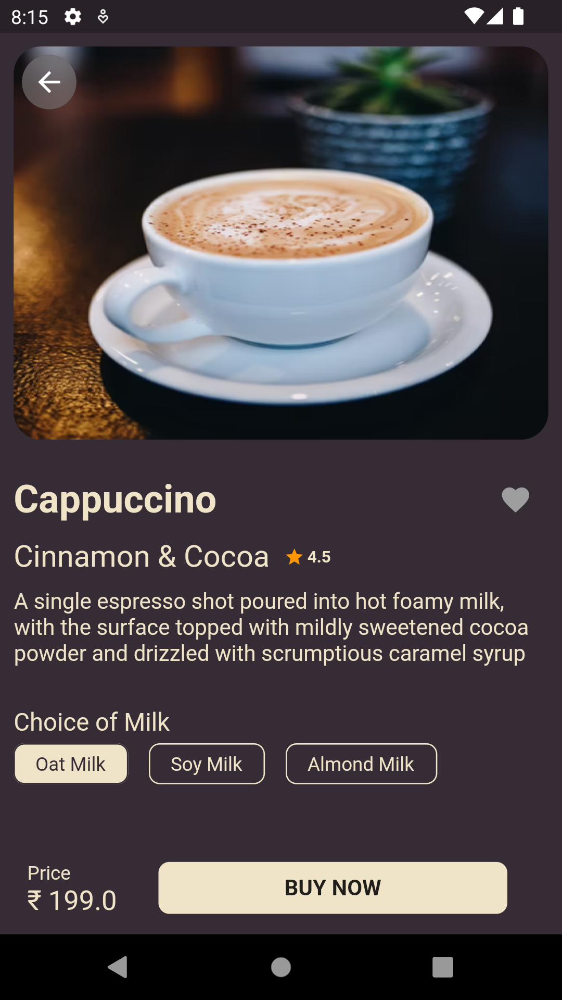

# Flutter UI Design Day 51-60

## Development Setup
Clone the repository and run the following commands:
```
flutter pub get
flutter run
```

# ScreenShot


## Day 51 - <a href="https://www.uplabs.com/posts/best-trending-nft-marketplace-mobile-app-ui-ux-design">NFT Marketplace</a>
 
 

<br>

## Day 52 - <a href="https://www.uplabs.com/posts/modern-creative-fitness-workout-mobile-app-ui-ux-design-ui-kit">Fitness Workout</a>
 
  

<br>

## Day 53 - <a href="https://dribbble.com/shots/15288851-Agency-App-Design">Agency App Design</a>
 


<br>

## Day 54 - <a href="https://www.figma.com/community/file/1050295107596166499">Coffee Delivery App</a>
 
 